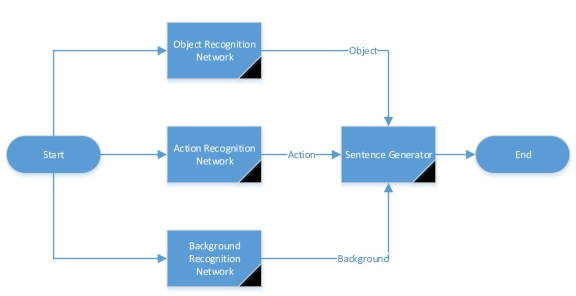
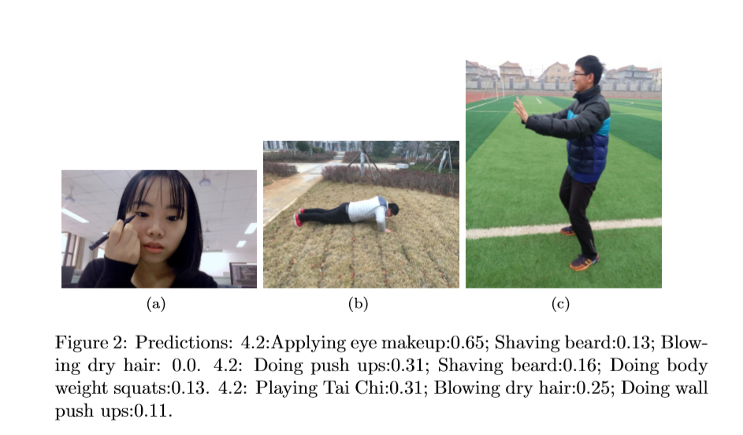
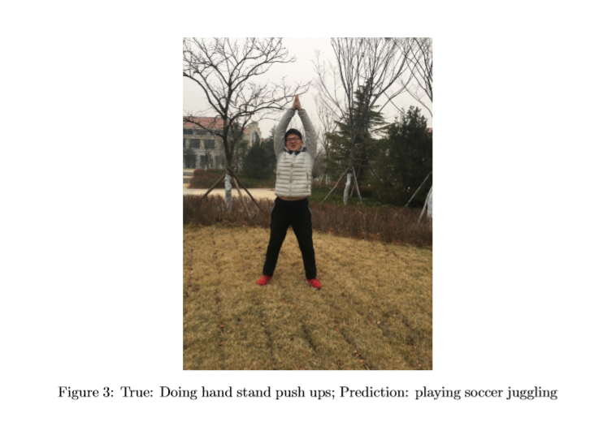
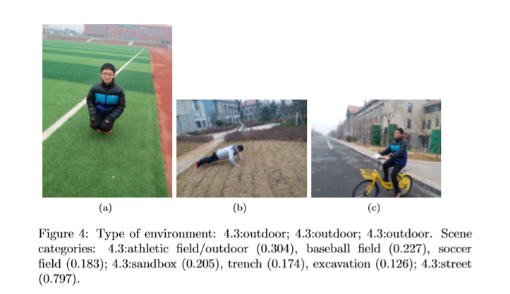
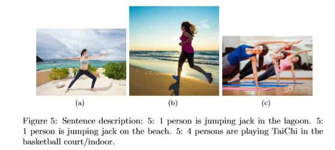
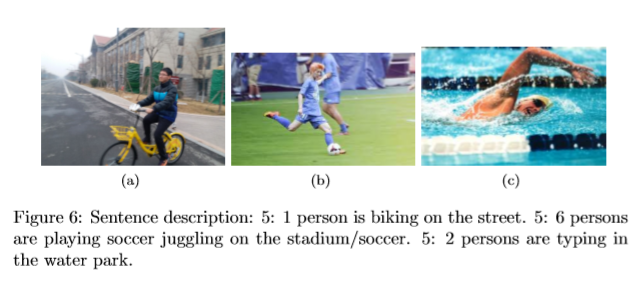
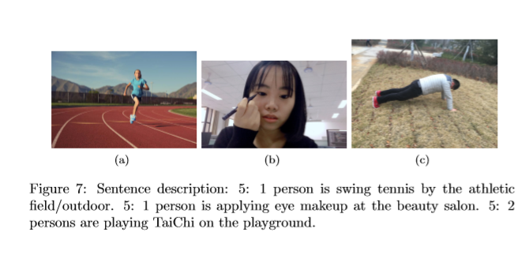
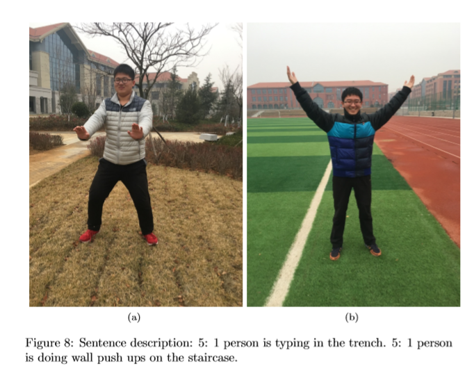

# Picture2Sentence
### Image to Text: Using Three Separate Networks and a Sentence Generator

#### abstract

Nowadays, text recognition in images is more and more popular, which makes a computer system to describe a picture automatically. We develop an approach with three irrelevant networks, each generates the object, the action as well as the background. Then we make sentences using these words. Unlike most previous works that make a sentence randomly, not caring about the grammar and the meaning, our works guarantee the rightness of the sentence. And our experimental results perform well.

#### Introduction

Reading text from photographs is a very challenging visual recognition problem, and it is very useful in our real life. For example, there are more and more people sharing their pictures in the social network sites, without leaving a comment, which makes it much more difficult for the Internet to retrieve the most suitable picture. However, the previous work only gives a sentence without guarantee the sentence correctness and the memory occupancy is too high to accept. 

In this paper, we propose an approach using three networks, each recognizes the object, the action as well as the background of the picture and in the end, we make a sentence using those words given from the networks. In order to get the object, we use the YOLO2 network(Real-Time Object Detection)[2], which does a good job in recognizing the foreground and it costs little time that is acceptable. For the second network, we use Convolutional Neural Networks–a powerful class of models that can act directly on the raw inputs. In order to achieve scene recognition, we apply a dataset called Places365[3] training with CNN, which can do a perfect job. The three networks are irrelevant so that we can run them at the same time, which can effectively reduce the running time. In order to make a reasonable sentence, we use a model like ’some people is/are doing activities in/on/at the places’. 

In conclusion, our contributions are as follows:

-  We proposed an approach using three networks and a sentence generator. Each network is particularly good at doing their single jobs and the three network can run at the same time due to their irrelevance. In this way, we can reduce the running time and guarantee the correctness as well.
- The experimental results demonstrate that our approach receives a very good result with short running time.

The paper is organized as follows. Section 2 will review the related literature. In Section 3, we will present the general framework while the details of our approach will be introduced in 4. Section 5 shows the experimental result including the performance as well as the running time. Conclusion of the paper is in Section 6.

#### Related Works

In recent years, many machine learning researchers began to try to mine information from the picture, automatically generate descriptions of pictures. Here, we list some states-of-arts algorithms. Google Research claimed to be able to scout pictures and make textual descriptions of the pictures: a combination of computer vision and natural language processing, Convolutional Neural Network (CNN) technique is used to analyze the image, extract the information from the image, and generate texts by recurrent neural network (RNN)[4]. Andrej Karpathy proposed a method that can be used to generate a natural language description of an image and it contains two parts (1) visual semantic alignment model; (2)generate a text description of the Multimodal RNN model for the new image[5]. Y Yang proposed a sentence generation strategy that describes images by predicting the most likely nouns, verbs, scenes and prepositions that make up the core sentence structure[6]. 

The idea is very intuitive, a sentence has specific grammars so we only need to determine every component of a sentence and use very simple methods to combine them to a sentence. In our experiment, we adopted the third idea.

 
Figure 1: General Framework

#### General Framework

As is shown in Figure 1, we test the picture using three networks and receive the object, action, and the background of the picture after we receive a picture,. Then we put these words into the sentence generator and receive a full sentence.

#### Approach Details

In this part, we will focus on the details of the method. In Subsection 4.1, we would like to introduce the network finding the objects and details of action recognition will be introduced in Subsection 4.2. How to get the background of the picture will be introduced in Subsection 4.3. Then Subsection 4.4 will introduce the details of how to make a sentence.

##### Object Recognition

We use the model called ‘YOLO2’[2] to recognize the objects of a picture. YOLO2 is famous for its short running time as well as being good at recognizing the foreground objects. 

First, ‘YOLO’ divides the input image into an 7×7 grid and then, for each grid cell predict 2 bounding boxes, and confidence for those boxes, and 20 class probabilities. Therefore, there will be a 7×7×30 tensor prediction.

In order to make the system better, ‘YOLO2’ adopts some extra measures such as adding batch normalization on all of the convolutional layers, using anchor boxes to predict bounding boxes, and running k-means clustering on the training set bounding to automatically find good priors.

##### Action Recognition

 

In this part, we will focus on the details of action recognition. We use the model with convolutional neural networks [1]. At first, we want to classify the action from the video using the model called ’LSTMs’(Long Short Term Memory networks)–a special kind of RNN, capable of learning long-term dependencies, because a video can explain the action much better than just an image. A picture may have different action recognition from different people after all. However, the results of the ’LSTMs’ are too poor to accept, so we turn to use CNNs. 

The database we use is UCF101, which is the largest dataset of human actions. We take out the key frame information in these videos and each frame has a label as same as the one of the video. Then some of the pictures are trained through a convolutional neural network while others are used as test objects. Because of the limited time, we only trained 34 classes which is more usual in our school life. 

As for the model, we first download the weights from ‘imagenet’ to accelerate the running time as well as improve the performance. Then there is a pooling layer and a dense layer following. The experimental results are pretty satisfactory. The training cost is around 30 minutes with the loss of 0.148 and the accuracy of 0.96. We also test some photos taken by ourselves, there are some examples in Figure 4. 

However, there exists some upset results. Take Figure 3 as an example, because we do not separate the background while training, the background will influence the action a lot. most examples of doing hand stand push ups are indoors while most training objects playing soccer juggling on the grass. Therefore, if a separation of the picture is done at the beginning of training, the result may be better.

##### Background Recognition

To achieve background recognition, we start with scene detection, applying a dataset called Places365[3]. Places365 is a subset of Places2 Database, containing about 1.8 million images from 365 scene categories, where there are at most 5000 images per category. Convolutional neural networks can be trained on Places365 to get the pre-trained model. Such a dataset is enough to deal with our daily scenes. In the following tests, most of our test scenes can be well recognized. 

Various CNNs are trained on Places365 to get the pre-trained model, such as AlexNet, GoogleNet, VGG16 and ResNet50, in which ResNet50 pre-trained model is selected to train Places365 model using pytorch library. ResNet50 is Preact ResNet with 50 layers. 

For each image, it will produce a list of 5 scene categories in descending order of confidence. The quality of a labeling will be evaluated based on the label that best matches the ground truth label for the image. The idea that generates 5 scene categories each image is to allow an algorithm to identify multiple scene categories in an image given that many environments have multi-labels. 

As the final result applying ResNet50, the top1 error is 45.26%, the top5 error is 15.02% on the validation set. Some results are listed in Figure 3.

 

 

##### Sentence Generator

Generally, the structure of the sentence is Subject + predicate + object + place adverbial. 

As the action network can only identify human movements, so we set Subject person or persons. We suppose the tense of the sentence is in progress, so the predicate of the sentence is ”is” or ”are” followed by a verb+ing. The relative troublesome part is the adverbial adjunct, because the background recognition network’s output is only a place without preposition. So we construct a corpus that match correct preposition with the background place. Finally, we integrate them to a sentence.

#### Experiment

 

 

  

In this part, we will introduce the experimental result of our approach and the performance of each network. Besides, the running time will also be showed in the last of this part. 

Figure 5,6,7,8 give some examples to show how the integrated network works. The effectiveness of the network is mainly determined by the action recognition. And it can be confusing when only given a picture. When given a series picture or video, it will works better. And the background recognition network is inexpert when encounters a narrow space or a small part of a space, Figure 5 shows our judgement. So it is relative fast in image to text work. 

Although it has some limitations, but it can guarantee the correctness of the sentence. 

At last, we give the time used to execute the integrated network. Time is mainly used on the load weight file when first executes the program. So we can ignore it. And in a intel i7 without a video card machine, it costs about 4 seconds per picture.

#### Conclusion

In this paper, we proposed an algorithm to give a description to an image using three divided networks and a sentence generator. For each network, we can get some information about the object, action and the background. Then these words are made into a sentence by a sentence generator. The experimental results present a great performance of our algorithm and the running time is also very acceptable.

#### References

[1] Khurram Soomro, Amir Roshan Zamir and Mubarak Shah, UCF101: A Dataset of 101 Human Action Classes From Videos in The Wild., CRCVTR-12-01, November, 2012.
[2] Redmon, Joseph and Farhadi, Ali, YOLO9000: Better, Faster, Stronger., arXiv preprint arXiv:1612.08242, 2016
[3] zhou2017places, Places: A 10 million Image Database for Scene Recognition,Zhou, Bolei and Lapedriza, Agata and Khosla, Aditya and Oliva, Aude and Torralba, Antonio, IEEE Transactions on Pattern Analysis and Machine Intelligence,2017, IEEE
[4] Yezhou Yang, Corpus-guided sentence generation of natural images, Proceeding EMNLP ’11 Proceedings of the Conference on Empirical Methods in Natural Language Processing Pages 444-454
[5] Karpathy A, Li F F. Deep visual-semantic alignments for generating image descriptions[C]// Computer Vision and Pattern Recognition. IEEE, 2015:3128-3137.
[6] Yang Y, Teo C L, Aloimonos Y. Corpus-guided sentence generation of natural images[C]// Conference on Empirical Methods in Natural Language Processing. Association for Computational Linguistics, 2011:444-454.

### How to use it

1. Download Place365 from https://github.com/CSAILVision/places365.git
2. Download YOLO
3. Download motion recognition from https://github.com/harvitronix/five-video-classification-methods
4. Change those absolute paths
5. place the main.py into YOLO/darknet

### Contribution

[Zhang Yinan](https://github.com/zhangynnancy)

[Yang Haoran](https://github.com/HolenYHR)

[Liu Zhongkun](https://github.com/LZKSKY)

[Zhu Li](https://github.com/Nimonm)

[Zhang Xinyu](https://github.com/Lagrant)

[Chao Daren](https://github.com/daren996)

